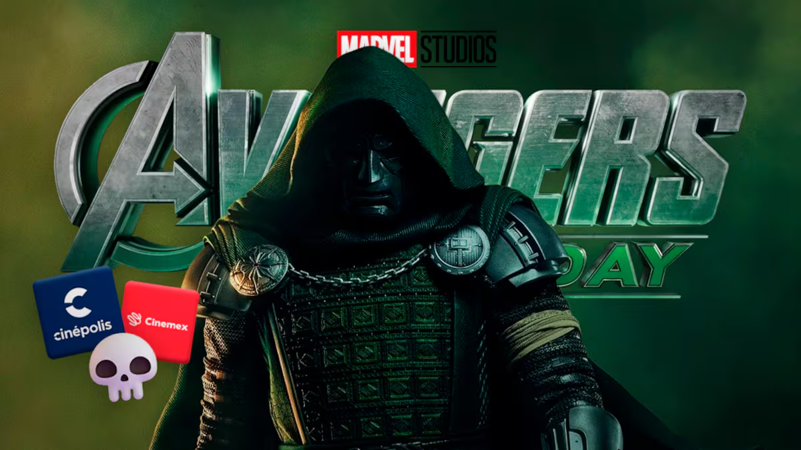

# Avengers: Doomsday colapsa las plataformas de Cinemex y Cinépolis

La preventa de la pelicula de **"Avengers: Doomsday"** causó una oleada de fans que saturo las plataformas de *Cinépolis* y *Cinemex*, que ~~provocó~~ fallos y algunos errores en la `compra de las entradas.`

## Que causó esto?
Los usuarios pidieron y reportaron muchos problemas durante la preventa de la película:

- No cargaban las paginas
- Hubieron erros en el sistema
- Al elegir las entradas no se podia a dar a confirmar

Cines que colapsaron:

1. Cinépolis
2. Cinemex

Cines que aceptaron las criticas:

- [x] Cinemex
- [ ] Cinepolis
## Enlace de la noticia y imagen
La noticia salio de esta [pagina](https://www.sdpnoticias.com/espectaculos/cine/preventa-de-avengers-doomsday-colapsa-plataformas-de-cinemex-y-cinepolis/)


## Bloques
> Un gran poder conlleva una responsabilidad
>
> — Spider-Man

Blockquotes can contain other markdown elements:

> **Tip:** Use `Cmd+Shift+Z` to enter zen mode for distraction-free writing.

## Codigo

```python 
for i in range (1,5)
    print("Yo soy Iron-Man")
```
## Tablas de horario

 
| Cinepolis | Cinemex | Hora |
|:--------|:------:|------:|
| Sala 2 | Sala 1 | 13:00 |
| Sala 3 | Sala 4 | 20:00 |
| Sala 5 | Sala 6 | 17:00 |

## Citas

> Marvel, un estudio que organizo una pelicula muy esperada para los fans. - Marvel Studios

---
Muchas gracias por ver esto. 
